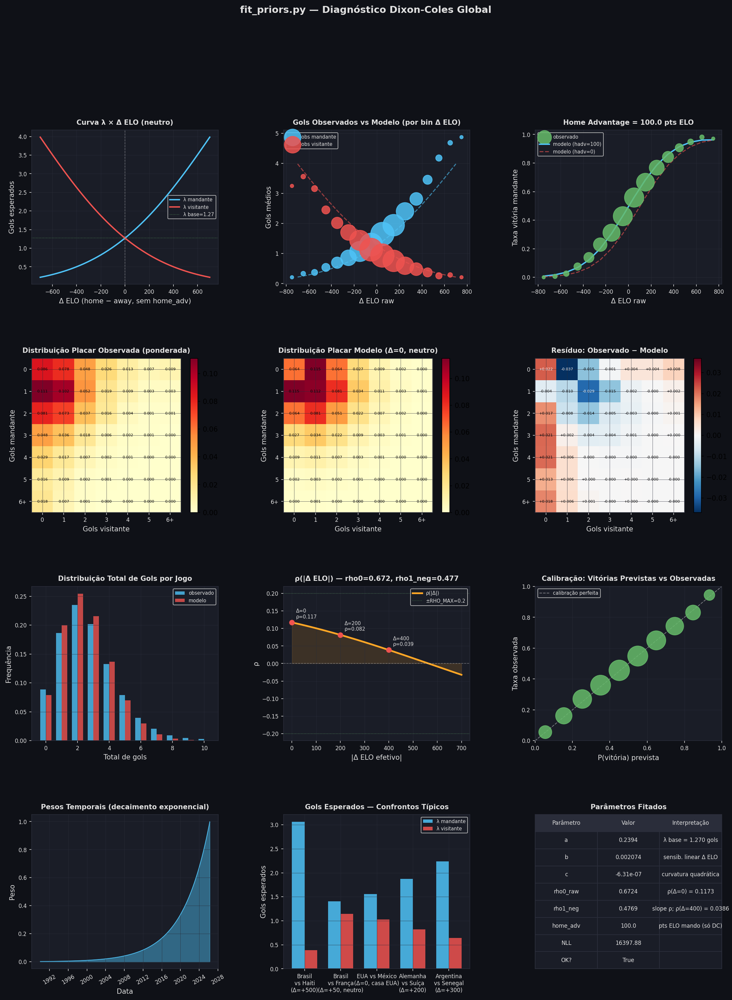
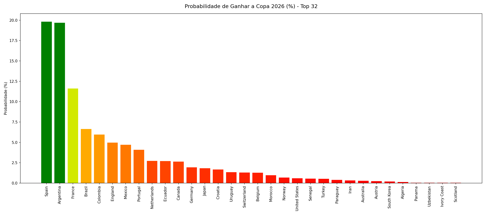
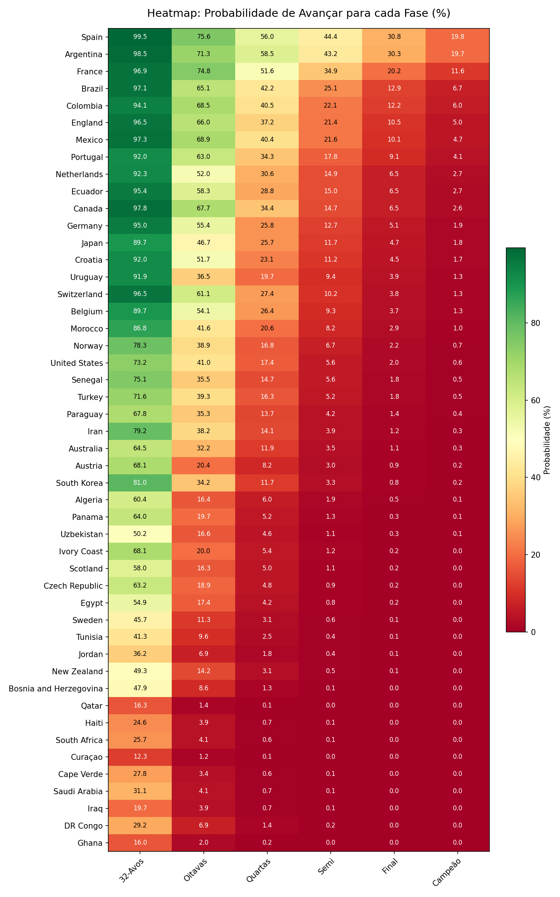

# White Paper - Modelagem Estatística para a Copa do Mundo FIFA 2026

**Previsão Probabilística via ELO, Redes Neurais Recorrentes e Simulação Monte Carlo**

## Índice

1. [Visão Geral e Processo de Inferência Estatística](#1-visão-geral-e-processo-de-inferência-estatística)
2. [O Sistema ELO como Proxy de Força Relativa](#2-o-sistema-elo-como-proxy-de-força-relativa)
3. [Das Diferenças ELO às Taxas Esperadas de Gols](#3-das-diferenças-elo-às-taxas-esperadas-de-gols)
4. [Os Fatores de Correção $K_{att}$ e $K_{def}$](#4-os-fatores-de-correção-k_att-e-k_def)
5. [O Modelo de Placares: Dixon-Coles sobre Poisson](#5-o-modelo-de-placares-dixon-coles-sobre-poisson)
6. [Simulação Monte Carlo do Torneio](#6-simulação-monte-carlo-do-torneio)
7. [Resultados](#7-resultados)
8. [Conclusão](#8-conclusão)
9. [Referências](#9-referências)

---

## 1. Visão Geral e Processo de Inferência Estatística

### 1.1 O Problema

Prever o vencedor de uma Copa do Mundo é essencialmente um problema de **inferência probabilística sobre um sistema estocástico com estrutura hierárquica**. O torneio é composto de dezenas de partidas interdependentes — o resultado de um jogo determina quem participa dos seguintes — e cada partida é, por si só, um evento de alta variância: equipes inferiores vencem equipes superiores com frequência não negligenciável. Modelar esse sistema corretamente exige responder a três perguntas distintas:

1. **Qual é a força relativa de cada seleção?** — pergunta de *estimação de parâmetros*
2. **Dado o par de times, qual é a distribuição de probabilidade sobre os possíveis placares?** — pergunta de *modelagem probabilística*
3. **Dada a distribuição sobre placares individuais, qual é a probabilidade de cada time vencer o torneio inteiro?** — pergunta de *propagação de incerteza* por uma estrutura combinatória complexa

O modelo desenvolvido neste trabalho responde a cada uma dessas perguntas com uma abordagem específica e fundamentada na literatura estatística.

### 1.2 Arquitetura Geral do Modelo

O pipeline de inferência opera em três etapas sequenciais:

**Etapa 1 — Estimação da força relativa via ELO.** A força de cada seleção é representada por seu rating ELO, calculado cronologicamente sobre todo o histórico de partidas internacionais desde 1872. A diferença de rating entre dois times ($\Delta_{eff}$) serve como variável explicativa fundamental: é a partir dela que se derivam as taxas esperadas de gols ($\lambda$) via uma função exponencial quadrática cujos parâmetros são estimados por máxima verossimilhança (MLE) sobre partidas desde 1990. O ELO captura a **força estrutural e histórica** de cada seleção.

**Etapa 2 — Correção pela forma recente e pelo perfil de jogo.** As taxas esperadas de gols derivadas do ELO representam a expectativa de longo prazo, mas o ELO não observa o *volume* de gols — apenas o resultado final (vitória, empate, derrota). Para incorporar tanto o **desempenho ofensivo e defensivo recente** quanto o **perfil de jogo estrutural** de cada seleção, dois fatores adimensionais são estimados por time: $K_{att}$ (multiplicador de ataque) e $K_{def}$ (multiplicador de defesa). Esses fatores são produzidos por uma rede neural recorrente do tipo GRU ([Cho et al., 2014](https://arxiv.org/abs/1406.1078)) treinada sobre os últimos $T = 20$ jogos de cada seleção, com decaimento exponencial por posição na sequência (meia-vida de 7 jogos). A taxa final é $\lambda_A = \lambda^{home} \cdot K_{att}^A \cdot K_{def}^B$, integrando força histórica, identidade ofensiva própria e vulnerabilidade defensiva do adversário.

**Etapa 3 — Distribuição de placares e propagação de incerteza.** As taxas finais esperadas de gols $\lambda_A$ e $\lambda_B$ alimentam o modelo de [Dixon e Coles, 1997](https://doi.org/10.1111/1467-9876.00065), que constrói uma distribuição de probabilidade conjunta sobre todos os placares possíveis (até 8 gols por time). O torneio completo é então simulado $N = 1.000.000$ de vezes via Monte Carlo, e as frequências observadas em cada fase constituem as estimativas finais de probabilidade.

O fluxo completo pode ser resumido em: `

- **Cálculo do Rating ELO** através do histórico de todas as partidas de todas as seleções. 
- **Taxa esperada de gols $\lambda$** como função da diferença de rating ELO entre as duas equipes (utilizando MLE sobre todos os jogos desde 1990). 
- **Correção por $K_{\mathrm{att}}$ e $K_{\mathrm{def}}$:** forma recente e estilo de jogo calculados utilizando uma rede neural GRU treinada sobre dados recentes.
- **Distribuição de placares via Poisson modificada por Dixon-Coles.** 
- **Simulação Monte Carlo: propagação de incerteza pelo torneio.** `

### 1.3 O Processo de Inferência Estatística em Detalhe

Formalmente, o modelo define dois conjuntos de parâmetros:

**Parâmetros dos priors** $\theta = \{a, b, c, h, \rho_0, \rho_1\}$: governam como a diferença ELO se traduz em taxas esperadas de gols e correlação. São estimados por **máxima verossimilhança (MLE)** sobre partidas internacionais desde 1990, com ponderação temporal por recência (meia-vida de 4 anos) e por importância do torneio. A função de log-verossimilhança maximizada é:

$$\hat{\theta} = \arg\max_{\theta} \sum_{i=1}^{N_{hist}} w_i^{temp} \cdot \log P_{\theta}(X_i, Y_i \mid \Delta_{eff,i})$$

onde $w_i^{temp} = \exp\!\left(-\frac{t_{ref} - t_i}{t_{1/2}}\right)$ é o peso temporal e $(X_i, Y_i)$ é o placar observado.

**Parâmetros da rede neural** $\phi$: pesos da GRU que mapeiam sequências de resultados recentes em fatores $K_{att}$ e $K_{def}$. São estimados por **descida de gradiente** (otimizador AdamW, $\eta = 2 \times 10^{-4}$) minimizando a log-verossimilhança negativa (NLL) Dixon-Coles ponderada, com regularização L2 sobre $\log K$:

$$\hat{\phi} = \arg\min_{\phi} \left[ -\sum_{i} w_i \cdot \log P_{\theta, \phi}(X_i, Y_i) \;+\; \lambda_{reg} \cdot \mathbb{E}\!\left[(\log K_{att})^2 + (\log K_{def})^2\right] \right]$$

com $\lambda_{reg} = 0.5$ e critério de parada antecipada com paciência de 25 épocas.

A separação entre os dois conjuntos de parâmetros é deliberada: $\theta$ captura regularidades de longo prazo no futebol, enquanto $\phi$ captura padrões recentes por seleção. Ambos são estimados a partir dos dados, sem imposição de valores a priori além da estrutura funcional.

---

## 2. O Sistema ELO como Proxy de Força Relativa

### 2.1 Origem e Princípio

O sistema ELO foi proposto pelo físico húngaro-americano Arpad Elo como método de rating para xadrez ([Elo, 1978](https://archive.org/details/ratingofchesspl00eloa)). Sua ideia central é que a força de um competidor pode ser representada por um único número real, e que a diferença entre dois números codifica diretamente a probabilidade de vitória de um sobre o outro. A atualização do rating após cada partida segue a regra:

$$\text{ELO}_i^{\,novo} = \text{ELO}_i^{\,antigo} + K_w \cdot G \cdot \bigl(S_i - \hat{p}_i\bigr)$$

onde $S_i \in \{0, 0.5, 1\}$ é o resultado real (derrota, empate, vitória), $\hat{p}_i$ é a probabilidade de vitória prevista antes da partida, $K_w > 0$ é o fator de importância do torneio e $G$ é um fator de margem de gols que amplifica o sinal de partidas com grandes diferenciais de placar:

$$G = \begin{cases} 1{,}0 & \text{se } |S_{home} - S_{away}| \leq 1 \\ 1{,}5 & \text{se } |S_{home} - S_{away}| = 2 \\ \frac{11 + |S_{home} - S_{away}|}{8} & \text{caso contrário} \end{cases}$$

A probabilidade de vitória prevista é dada pela função logística:

$$\hat{p}_A = \frac{1}{1 + 10^{-\Delta_{eff}/400}}$$
onde $\Delta_{eff} = \text{ELO}_A - \text{ELO}_B + h_{fit}$ 

Para o modelo Dixon-Coles, o efeito do mando de jogo é $h_{fit} = 100$ pontos (estimado por MLE). 

### 2.2 O ELO como Proxy Estatístico no Futebol

A questão de saber se o ELO é um bom proxy para a força relativa de seleções de futebol tem sido extensivamente estudada. É importante, contudo, contextualizar tanto as virtudes quanto as limitações do sistema no ambiente específico do futebol.

Em sistemas onde o ruído estocástico é nulo ou próximo de zero — como no xadrez, onde o resultado depende quase inteiramente da habilidade relativa dos jogadores — a diferença de ELO possui poder preditivo quase absoluto e imediato. No futebol, porém, a alta estocasticidade intrínseca ao esporte (gols acidentais, desvios de trajetória, decisões de arbitragem, variância nos pênaltis) faz com que o ELO opere estritamente como uma referência assintótica: ele se aproxima do "verdadeiro" nível de cada seleção apenas ao longo de muitas partidas. Esse ruído de curto prazo não pode ser eliminado pelo ELO por construção, o que torna indispensáveis as etapas posteriores do modelo — a correção pela GRU e a correção de Dixon-Coles — para mitigar esses efeitos em escala de partida individual.

[Hvattum e Arntzen (2010)](https://doi.org/10.1016/j.ijforecast.2009.10.002) compararam o ELO com seis métodos alternativos de previsão em futebol associativo e concluíram que o sistema ELO produz previsões competitivas — e em vários cenários superiores — quando usado como covariável em modelos de regressão. A principal virtude do ELO é sua capacidade de comparar times de diferentes confederações e épocas a partir de um histórico unificado de resultados.

[Ley, Van de Wiele e Van Eetvelde (2019)](https://doi.org/10.1177/1471082X18817650) apresentaram uma comparação sistemática de dez modelos estatísticos para ranking de seleções, incluindo variantes do ELO e modelos Poisson bivariados. Os autores demonstram que modelos baseados em ELO têm desempenho preditivo comparável aos modelos estruturais mais complexos, especialmente quando combinados com ponderação temporal e por importância do torneio — exatamente as características incorporadas ao nosso pipeline.

[Gilch e Müller (2018)](https://arxiv.org/pdf/1806.01930) aplicaram modelos de regressão Poisson com covariáveis ELO para prever a Copa do Mundo de 2018, utilizando simulação Monte Carlo para estimar probabilidades de classificação em cada fase. Esse trabalho é metodologicamente análogo ao nosso e serve como referência de validação da abordagem.

Em síntese, o ELO não é uma medida perfeita — ignora escalação, lesões e características táticas específicas — mas é um **proxy estatisticamente bem fundamentado** para a força relativa de seleções, robusto a variações de base de dados e computacionalmente eficiente. Essas propriedades justificam seu uso como âncora do modelo, desde que complementado pelas correções descritas nas seções seguintes.

### 2.3 Pesos por Importância de Torneio

Nem todas as partidas têm o mesmo valor informativo. Um amistoso jogado com escalação experimental diz muito menos sobre a real capacidade de uma seleção do que uma semifinal de Copa do Mundo. Para refletir isso, cada jogo recebe um fator $K_w$ proporcional à sua relevância competitiva, usado tanto na atualização do ELO quanto na ponderação da função de verossimilhança:

| Categoria                                   | Torneios                                                               | $K_w$ |
| :------------------------------------------ | :--------------------------------------------------------------------- | :---: |
| Copa do Mundo (FIFA)                        | Copa do Mundo FIFA                                                     |  40   |
| Campeonatos continentais e grandes torneios | Copa das Confederações, Eliminatórias Mundiais, Olimpíadas, etc.       |  35   |
| Qualificatórias e ligas nacionais           | UEFA Euro, CONCACAF Nations League,  Copa América, AFC Asian Cup, etc. |  30   |
| Amistosos                                   | -                                                                      |  25   |
| Torneios não mapeados                       | -                                                                      |  28   |

Para a estimação dos priors por MLE, existe ainda um peso temporal adicional independente: $w_i^{temp} = \exp\!\left(-\frac{t_{ref} - t_i}{t_{1/2}}\right)$, com meia-vida de $t_{1/2} = 4$ anos (1.460 dias). Jogos mais antigos têm influência decrescente na calibração dos parâmetros, refletindo a evolução do futebol ao longo do tempo. O ELO, por sua vez, é calculado desde 1872 sem corte — ele "aquece" nos dados antigos — e a MLE usa apenas partidas a partir de 1990 com o ELO já estabilizado.

Para amistosos, aplica-se ainda um peso de torneio adicional de $w_{friendly} = 0.7$, multiplicado ao peso temporal. Para todos os demais torneios, $w_{torneio} = 1.0$.

### 2.4 Vantagem de Sede

Para a Copa 2026, os países sede — EUA, México e Canadá — jogam com uma vantagem estrutural documentada: familiaridade com o ambiente, apoio da torcida, menor desgaste de viagem e ausência de adaptação climática e de altitude. Essa vantagem é modelada como um deslocamento aditivo no delta ELO efetivo utilizado no cálculo das taxas esperadas de gols:

$$\Delta_{eff} = (\text{ELO}_A - \text{ELO}_B) + h_{fit} $$

O parâmetro $h_{fit}$ é estimado por MLE conjuntamente com os demais priors. O valor calibrado foi $h_{fit} = 100{,}0$ pontos ELO, equivalente a dizer que jogar como país sede aumenta a taxa esperada de gols do time anfitrião por um fator de $e^{b \cdot h_{fit}} \approx e^{0{,}002 \times 100} \approx 1{,}22$ — ou seja, aproximadamente 22% mais gols esperados do que em campo neutro, tudo o mais constante.

---

## 3. Das Diferenças ELO às Taxas Esperadas de Gols

### 3.1 Por que Modelar Gols como Poisson?

A distribuição de Poisson descreve o número de ocorrências de um evento raro em um intervalo fixo de tempo ou espaço, sob a hipótese de que os eventos ocorrem a uma taxa média constante $\lambda$ e de forma (aproximadamente) independente entre si. A probabilidade de observar exatamente $k$ eventos é:

$$P(X = k \mid \lambda) = \frac{\lambda^k \, e^{-\lambda}}{k!}, \quad k = 0, 1, 2, \ldots$$

A adequação do modelo de Poisson para gols no futebol foi estabelecida empiricamente por [Maher (1982)](https://doi.org/10.1111/j.1467-9574.1982.tb00782.x). Maher incorporou parâmetros de ataque e defesa por equipe e mostrou, por meio de testes de aderência ($\chi^2$), que o modelo de Poisson independente descreve adequadamente as frequências de placares no futebol inglês, embora com pequenos desvios sistemáticos nos placares baixos — um problema que Dixon e Coles resolveriam quinze anos depois. O modelo de Poisson para gols tornou-se, desde então, o ponto de partida padrão na literatura de estatística esportiva ([Dixon e Coles, 1997](https://doi.org/10.1111/1467-9876.00065); [Karlis e Ntzoufras, 2003](https://doi.org/10.1080/0269994031000083876)).

### 3.2 Da Diferença ELO à Taxa Esperada de Gols

Para converter $\Delta_{eff}$ em taxas esperadas de gols $\lambda$, adotamos uma função exponencial quadrática:

$$\lambda^{home}(\Delta_{eff}) = \exp\!\bigl(a + b\,\Delta_{eff} + c\,\Delta_{eff}^2\bigr)$$

$$\lambda^{away}(\Delta_{eff}) = \exp\!\bigl(a - b\,\Delta_{eff} + c\,\Delta_{eff}^2\bigr)$$

Os parâmetros $\{a, b, c\}$ são estimados conjuntamente com os demais priors por MLE. Os valores calibrados e suas interpretações são apresentados na Seção 7.1.

**Interpretação do parâmetro $a$:** O intercepto determina a taxa esperada de gols quando os dois times têm ELO idêntico ($\Delta_{eff} = 0$). Nesse caso, $\lambda = e^a$ para ambos. O valor calibrado foi $a = 0{,}2394$, correspondendo a $\lambda = e^{0{,}2394} \approx 1{,}270$ gols por time por jogo em campo neutro com times de igual força — coerente com a média histórica do futebol internacional de alto nível.

**Interpretação do parâmetro $b$:** O coeficiente linear captura a assimetria induzida pela diferença de qualidade. O valor calibrado foi $b = 0{,}002074$: para cada 100 pontos ELO de vantagem, a taxa esperada de gols do time superior aumenta por $e^{0{,}002074 \times 100} \approx 1{,}231$ (23% mais gols esperados), enquanto a do inferior diminui simetricamente.

**Interpretação do parâmetro $c$:** O coeficiente quadrático captura a saturação para grandes diferenciais. O valor calibrado foi $c = -6{,}31 \times 10^{-7}$, ligeiramente negativo, indicando que o efeito marginal de cada ponto ELO adicional decresce para diferenciais muito elevados — o que é empiricamente razoável, pois não se pode marcar infinitos gols independentemente de quão superior se é.

### 3.3 Verificação de Consistência

Por construção, as duas funções são simétricas: inverter os papéis dos times ($\Delta_{eff} \to -\Delta_{eff}$) troca $\lambda^{home}$ por $\lambda^{away}$:

$$\lambda^{home}(+\Delta) = \lambda^{away}(-\Delta)$$

Essa simetria garante que o modelo seja internamente consistente: a taxa esperada de gols de $A$ contra $B$ em campo de $A$ é exatamente o que o modelo preveria para $B$ se o jogo fosse espelhado.

### 3.4 O Parâmetro $\rho$ — Correlação de Dixon-Coles

O parâmetro $\rho$ captura a dependência estatística entre os gols das duas equipes em uma mesma partida. Sua dependência de $|\Delta_{eff}|$ é modelada por:

$$\rho(\Delta_{eff}) = \rho_{max} \cdot \tanh\!\left(\rho_0 - \rho_1^{neg} \cdot \frac{|\Delta_{eff}|}{400}\right)$$

com $\rho_{max} = 0{,}2$. Os parâmetros $\rho_0$ e $\rho_1^{neg}$ são parâmetros da curva de decaimento — não confundir com o próprio $\rho$, que é o valor de correlação resultante para um dado $\Delta_{eff}$. O valor de $\rho_1^{neg}$ é forçado a ser não-negativo via $\rho_1^{neg} = \text{softplus}(\rho_1^{raw})$, garantindo que $\rho$ seja monotonamente decrescente em $|\Delta_{eff}|$ — partidas mais desequilibradas têm menor dependência entre os gols.

Os valores calibrados foram $\rho_0^{raw} = 0{,}6724$ e $\rho_1^{neg} = 0{,}4769$, resultando em:

- $\rho(\Delta_{eff} = 0) = 0{,}117$ — correlação em jogo equilibrado
- $\rho(\Delta_{eff} = 400) = 0{,}039$ — correlação em jogo com 400 pts de diferença

Esses valores são coerentes com a estimativa original de [Dixon e Coles (1997)](https://doi.org/10.1111/1467-9876.00065), que obtiveram $\rho \approx -0{,}13$ (com sinal oposto por diferença de convenção) para o futebol inglês.

---

## 4. Os Fatores de Correção $K_{att}$ e $K_{def}$

### 4.1 Motivação: As Duas Limitações do ELO

O rating ELO é, por construção, uma medida de longo prazo: ele se atualiza incrementalmente a cada partida e converge lentamente para o "verdadeiro" nível de uma seleção. Isso gera duas limitações importantes quando o objetivo é modelar o volume de gols de uma partida específica.

**Primeira limitação — forma recente.** Um time pode ter ELO historicamente elevado mas estar em crise de resultados: mudança de treinador, lesões em jogadores-chave, período de adaptação tática. Outro pode ter ELO modesto mas estar em ascensão acelerada. O ELO não refletirá essas divergências de forma imediata.

**Segunda limitação — estilo de jogo e identidade ofensiva.** O ELO é cego ao *como* uma equipe vence ou perde: ele registra apenas o resultado (vitória, empate, derrota), não o placar. Dois times com ELO idêntico podem ter perfis de jogo radicalmente diferentes. Uma seleção de estilo ofensivo pode vencer por 4–2 e perder por 1–3, acumulando muitos gols nos dois lados; outra, de estilo defensivo e pragmático, pode vencer por 1–0 e empatar por 0–0, com poucos gols em ambos os sentidos. Para o ELO, os dois comportamentos são indistinguíveis. Contudo, para a modelagem de placares via Poisson, a diferença é fundamental: a taxa esperada de gols $\lambda$ de cada time é muito diferente entre os dois perfis, mesmo com força igual.

Os fatores $K_{att}$ e $K_{def}$ corrigem ambas as limitações simultaneamente, pois são estimados a partir dos gols marcados e sofridos nos jogos recentes de cada seleção — informação que o ELO descarta completamente.

Formalmente: $K_{att} > 1$ significa que o time marca mais gols do que seu ELO preveria; $K_{att} < 1$, o contrário. $K_{def} < 1$ indica que o time sofre menos gols do que o esperado para seu nível ELO (defesa sólida ou estilo defensivo); $K_{def} > 1$, maior vulnerabilidade relativa. Ambos são adimensionais e centrados em 1: quando não há evidência de desvio, a rede retorna $K \approx 1$.

### 4.2 A Combinação com a Taxa Esperada de Gols

As taxas finais esperadas de gols que alimentam a distribuição de placares são:

$$\lambda_A = \lambda^{home}(\Delta_{eff}) \cdot K_{att}^A \cdot K_{def}^B$$

$$\lambda_B = \lambda^{away}(\Delta_{eff}) \cdot K_{att}^B \cdot K_{def}^A$$

O número esperado de gols de $A$ é, portanto, o produto de três componentes: o referencial do diferencial ELO, a correção pelo perfil ofensivo e forma recente do próprio time $A$ ($K_{att}^A$), e a correção pela vulnerabilidade defensiva e forma recente do adversário $B$ ($K_{def}^B$). O ataque de $A$ encontra a defesa de $B$; cada um entra com seu fator multiplicativo.

Se todos os fatores forem iguais a 1, $\lambda_A = \lambda^{home}$ — o modelo reduz ao prior puro, baseado apenas no diferencial ELO.

### 4.3 A Rede Neural GRU

Os fatores $K_{att}$ e $K_{def}$ são produzidos por uma **rede neural recorrente do tipo GRU** (*Gated Recurrent Unit*), introduzida por [Cho et al. (2014)](https://arxiv.org/abs/1406.1078) e empiricamente avaliada por [Chung et al. (2014)](https://arxiv.org/abs/1412.3555). A GRU processa a sequência dos últimos $T = 20$ jogos de cada seleção. Para cada jogo $t$ da sequência, são extraídas seis variáveis ($F = 6$):

1. Diferença ELO normalizada: $\Delta_{elo} / 400$
2. Gols marcados pela seleção naquele jogo (normalizados por 3)
3. Gols sofridos pela seleção naquele jogo (normalizados por 3)
4. Peso do torneio $w_i$ (importância competitiva da partida)
5. Resultado codificado: $+1$ (vitória), $0$ (empate), $-1$ (derrota)
6. Decaimento por posição: $e^{-\lambda_{decay} \cdot pos}$, com $\lambda_{decay} = \ln 2 / 7 \approx 0{,}099$ (meia-vida de 7 jogos)

Essas variáveis formam um tensor de entrada de dimensão $T \times 6$. Times com menos de $T$ jogos são completados com zeros (*zero-padding*).

#### A Mecânica da GRU

A GRU mantém um vetor de estado oculto $h_t \in \mathbb{R}^{H}$ (com $H = 48$) atualizado a cada passo por:

$$z_t = \sigma(W_z x_t + U_z h_{t-1} + b_z) \quad \text{(gate de atualização)}$$

$$r_t = \sigma(W_r x_t + U_r h_{t-1} + b_r) \quad \text{(gate de reset)}$$

$$\tilde{h}_t = \tanh\!\bigl(W_h x_t + U_h (r_t \odot h_{t-1}) + b_h\bigr) \quad \text{(estado candidato)}$$

$$h_t = (1 - z_t) \odot h_{t-1} + z_t \odot \tilde{h}_t \quad \text{(estado atualizado)}$$

O **gate de atualização** $z_t$ atua como uma *constante de inércia* do sistema: quando $z_t \approx 0$, o estado oculto é mantido essencialmente inalterado, o que equivale a dizer que o novo jogo é pouco informativo — o modelo filtra variações ruidosas do desempenho recente e não as incorpora ao perfil da seleção. Quando $z_t \approx 1$, o estado é completamente substituído pelo candidato, refletindo uma atualização decisiva na visão do modelo sobre a equipe.

O **gate de reset** $r_t$ funciona como um *gatilho de detecção de ruptura*: quando $r_t \approx 0$, o candidato $\tilde{h}_t$ é computado ignorando quase inteiramente o histórico acumulado, permitindo que o modelo descarte o estado anterior frente a uma mudança estrutural abrupta — como uma troca súbita de comando tático ou uma série atípica de resultados que rompe com o padrão estabelecido. Combinados, os dois gates permitem à GRU distinguir entre flutuação normal de desempenho (que deve ser suavizada) e ruptura estrutural (que exige reinicialização do estado), produzindo estimativas de $K_{att}$ e $K_{def}$ que refletem o perfil corrente da seleção sem se deixar enganar por ruído.

O estado oculto final $h_T$ é projetado por uma rede *feedforward* com uma camada oculta de 32 neurônios com ativação ReLU:

$$k^{raw} = W_2 \cdot \text{ReLU}(W_1 h_T + b_1) + b_2 \in \mathbb{R}^2$$

Os escalares brutos são então mapeados para os fatores $K$ positivos pela função **softplus**:

$$K_{att} = \ln(1 + e^{k_{att}^{raw}}) + \varepsilon, \quad K_{def} = \ln(1 + e^{k_{def}^{raw}}) + \varepsilon$$

com $\varepsilon = 10^{-2}$ garantindo $K > 0$ para todo input.

### 4.4 Compartilhamento de Pesos e Regularização

A mesma GRU é utilizada para processar a sequência de qualquer seleção. Esse **compartilhamento de parâmetros** força o modelo a aprender uma representação universal de "forma recente" que seja interpretável da mesma forma para qualquer time, e age como regularização implícita: com 48 seleções e 20 jogos cada, o dataset é modesto, e parâmetros compartilhados reduzem o risco de sobreajuste.

A regularização explícita é feita por um termo L2 sobre $\log K$:

$$\mathcal{L}_{reg} = \lambda_{reg} \cdot \mathbb{E}\!\left[(\log K_{att})^2 + (\log K_{def})^2\right]$$

com $\lambda_{reg} = 0{,}5$. Como $\log(1) = 0$, essa regularização penaliza desvios de $K = 1$ de forma quadrática na escala logarítmica — equivalente a um prior log-normal centrado em 1. Times com histórico recente pouco informativo regridem ao referencial do ELO ($K \approx 1$).

---

## 5. O Modelo de Placares: Dixon-Coles sobre Poisson

### 5.1 O Problema da Independência

O modelo de Poisson independente — gols de $A$ e $B$ como variáveis independentes com parâmetros $\lambda_A$ e $\lambda_B$ — seria a escolha mais simples. Contudo, [Dixon e Coles (1997)](https://doi.org/10.1111/1467-9876.00065) observaram empiricamente que esse modelo subestima sistematicamente a frequência dos placares 0-0, 1-0, 0-1 e 1-1, e superestima outros placares próximos. A causa é a dependência tática entre os times: o estado do placar influencia as escolhas de jogo de ambas as equipes, quebrando a hipótese de independência dos gols, especialmente em placares baixos.

### 5.2 A Correção de Dixon-Coles

Dixon e Coles propuseram uma correção multiplicativa aplicada exclusivamente aos quatro placares baixos:

$$P(X{=}x, Y{=}y) = \tau(x, y, \lambda_A, \lambda_B, \rho) \cdot \text{Pois}(x;\, \lambda_A) \cdot \text{Pois}(y;\, \lambda_B)$$

onde:

$$\tau(x, y) = \begin{cases}
1 - \lambda_A \lambda_B \rho & \text{se } x = 0,\; y = 0 \\[6pt]
1 + \lambda_A \rho & \text{se } x = 1,\; y = 0 \\[6pt]
1 + \lambda_B \rho & \text{se } x = 0,\; y = 1 \\[6pt]
1 - \rho & \text{se } x = 1,\; y = 1 \\[6pt]
1 & \text{caso contrário}
\end{cases}$$

Para $\rho > 0$, os fatores $\tau$ reduzem a probabilidade dos placares 1-0 e 0-1 (fatores $1 + \lambda_A \rho > 1$ e $1 + \lambda_B \rho > 1$ atuam como denominadores da redistribuição) e aumentam relativamente o 0-0 e o 1-1. O efeito líquido, para os valores típicos de $\lambda$ e $\rho$ calibrados, é um aumento da massa probabilística nos empates de placar baixo, consistente com o padrão histórico.

**Validade matemática:** Para que $\tau(0,0) = 1 - \lambda_A \lambda_B \rho > 0$, é necessário $\rho < 1/(\lambda_A \lambda_B)$. Com $\rho_{max} = 0{,}2$ e $\lambda \approx 1{,}27$, temos $1/(\lambda_A \lambda_B) \approx 0{,}62 \gg 0{,}2$, garantindo validade em todo o espaço de parâmetros utilizados. O valor $\rho = 0$ recupera o modelo de Poisson independente como caso especial.

### 5.3 A Distribuição sobre Resultados e Pênaltis

A partir da matriz de placares $M[x][y] = P(X=x, Y=y)$, as probabilidades de resultado são obtidas por:

$$P(\text{vitória } A) = \sum_{x > y} M[x][y], \quad P(\text{empate}) = \sum_{x = y} M[x][x], \quad P(\text{vitória } B) = \sum_{y > x} M[x][y]$$

Em partidas eliminatórias, empates levam à disputa de pênaltis. A probabilidade de vitória nos pênaltis é modelada proporcionalmente às taxas esperadas de gols:

$$P(A \text{ vence nos pênaltis}) = \frac{\lambda_A}{\lambda_A + \lambda_B}$$

### 5.4 A Função de Verossimilhança

O modelo é estimado por minimização da NLL ponderada:

$$\mathcal{L}_{NLL} = -\sum_{i=1}^{N} w_i \cdot \log P_{\theta,\phi}(X_i, Y_i)$$

onde o log da probabilidade Dixon-Coles de um placar $(X, Y)$ é:

$$\log P(X, Y) = \log \tau(X, Y) + X \log \lambda_A - \lambda_A - \log(X!) + Y \log \lambda_B - \lambda_B - \log(Y!)$$

---

## 6. Simulação Monte Carlo do Torneio

### 6.1 Por que Monte Carlo?

A Copa 2026 tem 48 seleções distribuídas em 12 grupos de 4 times. Os dois primeiros colocados de cada grupo mais os 8 melhores terceiros avançam para uma fase de 32 equipes, seguida de oitavas, quartas, semifinais e final. Calcular analiticamente $P(\text{time } A \text{ vence a Copa})$ exigiria somar as probabilidades de todas as trajetórias possíveis pelo chaveamento — um espaço combinatório intratável. A simulação Monte Carlo resolve isso pela amostragem estocástica: em vez de enumerar, simula-se o torneio completo $N$ vezes, e as frequências convergem às probabilidades verdadeiras pela Lei dos Grandes Números.

### 6.2 Pré-Computação das Matrizes de Placar

Para cada par ordenado de seleções $(i, j)$, a matriz de probabilidades de placar $M_{ij}$ de dimensão $9 \times 9$ (placares 0–8 por time) é calculada uma única vez antes do início das simulações. Com 48 times, há $48 \times 47 = 2.256$ matrizes a pré-computar. Esse investimento inicial torna cada simulação individual muito rápida: sorteia-se apenas um inteiro de uma distribuição discreta com 81 massas pré-computadas.

### 6.3 O Procedimento de Simulação

Cada uma das $N = 1.000.000$ de simulações executa o torneio completo:

**Fase de grupos:** Para cada um dos 12 grupos, os 6 confrontos ($\binom{4}{2} = 6$) são simulados sorteando um placar da distribuição $M_{ij}$. A classificação final é determinada pela seguinte hierarquia:
1. Pontos totais (3 por vitória, 1 por empate)
2. Confronto direto (pontos, saldo e gols no(s) jogo(s) direto(s))
3. Saldo de gols geral
4. Gols marcados no total
5. Sorteio (em caso de empate absoluto)

**Melhores terceiros:** Os 12 terceiros colocados são ordenados por pontos, saldo de gols e gols marcados. Os 8 melhores avançam, completando os 32 classificados.

**Fase eliminatória:** Em cada confronto, sorteia-se um placar de $M_{ij}$. Em caso de empate, decide-se nos pênaltis por uma Bernoulli com $p = \lambda_A / (\lambda_A + \lambda_B)$.

### 6.4 Estimativa das Probabilidades e Intervalos de Confiança

Após $N = 1.000.000$ de simulações, a estimativa da probabilidade de cada time atingir uma fase $f$ é:

$$\hat{p}_{i,f} = \frac{\text{número de simulações em que o time } i \text{ atingiu a fase } f}{N}$$

O intervalo de confiança binomial de 95% é:

$$IC_{95\%} = \hat{p}_{i,f} \pm 1{,}96 \cdot \sqrt{\frac{\hat{p}_{i,f}(1 - \hat{p}_{i,f})}{N}}$$

Com $N = 1.000.000$, a margem de erro máxima (95é $\pm 0{,}098\%$.

---

## 7. Resultados

### 7.1 Parâmetros do Modelo Calibrado

A tabela abaixo apresenta os seis parâmetros dos priors estimados por MLE, juntamente com sua interpretação e os valores derivados mais relevantes.

| Parâmetro      |                    Valor | Interpretação                                                                      |
| :------------- | -----------------------: | :--------------------------------------------------------------------------------- |
| $a$            |                   0,2394 | $\lambda = e^a = 1{,}270$ gols esperados por time em campo neutro com times iguais |
| $b$            |                 0,002074 | Sensibilidade linear: +100 pts ELO $\Rightarrow$ +23% gols esperados               |
| $c$            | $-6{,}31 \times 10^{-7}$ | Curvatura quadrática (saturação para grandes diferenciais)                         |
| $h_{fit}$      |              100 pts ELO | Vantagem de sede equivalente em pontos ELO                                         |
| $\rho_0^{raw}$ |                   0,6724 | $\rho(\Delta=0) = 0{,}117$ (correlação em jogo equilibrado)                        |
| $\rho_1^{neg}$ |                   0,4769 | Decaimento: $\rho(\Delta=400) = 0{,}039$                                           |

O painel de diagnóstico do modelo de priors é apresentado na figura abaixo:

O painel contém doze sub-gráficos: (i) a curva $\lambda \times \Delta\text{ELO}$, mostrando a relação exponencial simétrica entre diferencial e taxa esperada de gols; (ii) gols observados vs. modelados por bin de $\Delta\text{ELO}$, confirmando boa aderência; (iii) taxa de vitória do mandante por diferencial, com e sem vantagem de sede; (iv–vi) distribuições de placar observadas, modeladas e resíduos; (vii) distribuição total de gols por jogo; (viii) a curva $\rho(|\Delta\text{ELO}|)$; (ix) calibração de vitórias previstas vs. observadas; (x) pesos temporais; (xi) gols esperados em confrontos típicos; (xii) tabela de parâmetros fitados.

### 7.2 ELO e Fatores K por Seleção

A tabela abaixo apresenta, para cada seleção participante da Copa 2026, o rating ELO pré-torneio, os fatores $K_{att}$ e $K_{def}$ estimados pela GRU e o grupo de origem. As seleções estão ordenadas por ELO decrescente.

| # | Seleção | Gr | Sede | ELO | $K_{att}$ | $K_{def}$ |
|---|---------|----|----|-----:|----------:|----------:|
| 1 | Espanha | H | | 2182 | 0,9598 | 1,0897 |
| 2 | Argentina | J | | 2169 | 0,9626 | 1,0120 |
| 3 | França | I | | 2120 | 0,9634 | 1,0338 |
| 4 | Brasil | C | | 2061 | 0,9773 | 0,9607 |
| 5 | Inglaterra | L | | 2045 | 0,9554 | 0,9755 |
| 6 | Colômbia | K | | 2042 | 1,0070 | 0,9672 |
| 7 | Portugal | K | | 2025 | 0,9861 | 0,9831 |
| 8 | Holanda | F | | 2010 | 0,9863 | 1,0112 |
| 9 | Equador | E | | 1999 | 0,9001 | 0,8951 |
| 10 | Alemanha | E | | 1985 | 1,0084 | 1,0281 |
| 11 | Japão | F | | 1983 | 0,9566 | 0,9683 |
| 12 | Croácia | L | | 1981 | 0,9696 | 1,0125 |
| 13 | Marrocos | C | | 1968 | 0,8865 | 0,9876 |
| 14 | Uruguai | H | | 1961 | 0,9248 | 0,9291 |
| 15 | Suíça | B | | 1944 | 1,0140 | 1,0088 |
| 16 | Bélgica | G | | 1944 | 1,0133 | 0,9968 |
| 17 | Noruega | I | | 1932 | 1,0454 | 1,0505 |
| 18 | Turquia | D | | 1928 | 0,9629 | 1,0212 |
| 19 | México | A | ✓ | 1927 | 0,9580 | 0,9360 |
| 20 | Senegal | I | | 1922 | 0,9626 | 0,9840 |
| 21 | Paraguai | D | | 1893 | 0,9604 | 0,9399 |
| 22 | Áustria | J | | 1888 | 0,9704 | 0,9822 |
| 23 | Austrália | D | | 1886 | 0,9659 | 0,9670 |
| 24 | Canadá | B | ✓ | 1884 | 0,9474 | 0,9273 |
| 25 | Irã | G | | 1880 | 0,9669 | 0,9610 |
| 26 | Coreia do Sul | A | | 1861 | 0,9664 | 0,9854 |
| 27 | Argélia | J | | 1861 | 0,9643 | 0,9846 |
| 28 | Panamá | L | | 1822 | 0,9573 | 0,9954 |
| 29 | Uzbequistão | K | | 1817 | 0,9286 | 0,9393 |
| 30 | EUA | D | ✓ | 1809 | 1,0980 | 1,0510 |
| 31 | Costa do Marfim | E | | 1798 | 0,9496 | 0,9357 |
| 32 | Egito | G | | 1791 | 0,9102 | 0,9484 |
| 33 | Escócia | C | | 1791 | 0,9927 | 0,9502 |
| 34 | Suécia | F | | 1783 | 1,0876 | 1,0779 |
| 35 | Rep. Tcheca | A | | 1782 | 0,9809 | 0,9980 |
| 36 | Tunísia | F | | 1763 | 0,9623 | 0,9526 |
| 37 | Jordânia | J | | 1763 | 1,0615 | 1,0077 |
| 38 | DR Congo | K | | 1750 | 0,9123 | 0,9559 |
| 39 | Nova Zelândia | G | | 1730 | 1,1262 | 0,9742 |
| 40 | Iraque | I | | 1723 | 0,9046 | 0,9792 |
| 41 | Haiti | C | | 1676 | 1,0296 | 0,9933 |
| 42 | Arábia Saudita | H | | 1670 | 0,9797 | 0,9607 |
| 43 | Cabo Verde | H | | 1662 | 0,9560 | 0,9648 |
| 44 | Bósnia-Herz. | B | | 1651 | 0,9969 | 0,9442 |
| 45 | África do Sul | A | | 1645 | 0,9919 | 0,9906 |
| 46 | Gana | L | | 1626 | 1,0234 | 0,9977 |
| 47 | Curaçao | E | | 1586 | 1,0269 | 1,0280 |
| 48 | Catar | B | | 1553 | 1,0263 | 1,0561 |

**Leituras notáveis da tabela:**

- **Espanha e Argentina** lideram o ELO com vantagem clara sobre o campo. A Espanha apresenta $K_{def} = 1{,}090$, indicando que seu estilo de posse e pressão alta gera mais gols sofridos do que o esperado para uma equipe de seu nível — o ELO puro subestimaria sua vulnerabilidade defensiva. A Argentina tem $K_{def} = 1{,}012$, próximo ao neutro.
- **Colômbia** ($K_{att} = 1{,}007$, $K_{def} = 0{,}967$) e **Brasil** ($K_{def} = 0{,}961$) apresentam perfis defensivos sólidos, marcando menos e sofrendo menos do que o ELO preveria.
- **EUA** ($K_{att} = 1{,}098$, $K_{def} = 1{,}051$) têm perfil de alta intensidade em ambos os sentidos, com os dois fatores acima de 1 — combinação que, em campo próprio com a vantagem de sede, produz jogos de alto volume de gols.
- **Marrocos** ($K_{att} = 0{,}887$) e **Equador** ($K_{att} = 0{,}900$) têm os menores multiplicadores de ataque entre os times de ELO mais alto, indicando estilo mais cauteloso ofensivamente.
- **Nova Zelândia** ($K_{att} = 1{,}126$) tem o maior multiplicador de ataque entre todas as seleções, mas com ELO baixo (1.730), o efeito na taxa esperada de gols final é limitado.

### 7.3 Probabilidades de Título e Progressão por Fase

O gráfico abaixo apresenta as probabilidades de título para as 32 seleções mais favoritas, derivadas de 1.000.000 de simulações Monte Carlo:

O heatmap a seguir mostra as probabilidades de avançar a cada fase para todas as 48 seleções:

---

## 8. Conclusão

A equação central que resume o modelo é:

$$\lambda_A = \underbrace{\exp(a + b\,\Delta_{eff} + c\,\Delta_{eff}^2)}_{\text{força histórica (ELO)}} \;\cdot\; \underbrace{K_{att}^A}_{\substack{\text{ataque recente} \\ \text{+ perfil ofensivo}}} \;\cdot\; \underbrace{K_{def}^B}_{\substack{\text{defesa do adversário} \\ \text{+ perfil defensivo}}}$$

Este trabalho apresenta um modelo probabilístico para previsão de resultados na Copa do Mundo FIFA 2026, combinando três componentes que se complementam de forma coerente.

O **sistema ELO** fornece a base estrutural. A diferença de rating entre dois times, calculada cronologicamente sobre décadas de futebol internacional, é convertida em taxas esperadas de gols por uma função exponencial quadrática estimada por MLE sobre partidas desde 1990. Os parâmetros calibrados ($a = 0{,}239$, $b = 0{,}00207$, $c = -6{,}3 \times 10^{-7}$) são estatisticamente fundamentados e interpretáveis: a taxa esperada de 1,27 gols por time por jogo em campo neutro, o efeito de +23% de gols para cada 100 pontos ELO de vantagem e a vantagem de sede de 100 pontos ELO equivalente são todos consistentes com a literatura empírica.

Os **fatores $K_{att}$ e $K_{def}$**, estimados por uma rede neural GRU sobre os 20 jogos mais recentes de cada seleção, corrigem as duas limitações estruturais do ELO na modelagem de placares: a lentidão de adaptação à forma recente e a cegueira ao volume de gols. Os valores estimados revelam perfis de jogo distintos e empiricamente plausíveis: Espanha com defesa mais exposta do que seu ELO sugere ($K_{def} = 1{,}09$), Brasil com defesa compacta ($K_{def} = 0{,}96$), EUA com estilo de alta intensidade em ambos os sentidos, Marrocos e Equador com identidade ofensiva abaixo do ELO.

O **modelo de Dixon-Coles** traduz as taxas esperadas de gols $\lambda$ em distribuições de probabilidade sobre placares, corrigindo o viés da dupla-Poisson independente nos placares baixos. A **simulação Monte Carlo** com $N = 1.000.000$ de iterações propaga essa distribuição por toda a estrutura do torneio com margem de erro inferior a $\pm 0{,}1\%$.

O resultado central das simulações é a concentração de probabilidade entre Espanha e Argentina, cada uma com aproximadamente 20% de chance de título — reflexo de sua superioridade clara em ELO sobre o restante do campo. A França é a terceira favorita com 11,6%, seguida por Brasil (6,7%) e Colômbia (6,0%).

---

## 9. Referências

- **Cho, K., van Merrienboer, B., Gulcehre, C., Bahdanau, D., Bougares, F., Schwenk, H., & Bengio, Y. (2014).** *Learning Phrase Representations using RNN Encoder-Decoder for Statistical Machine Translation.* Proceedings of EMNLP 2014. [arXiv:1406.1078](https://arxiv.org/abs/1406.1078)

- **Chung, J., Gulcehre, C., Cho, K., & Bengio, Y. (2014).** *Empirical Evaluation of Gated Recurrent Neural Networks on Sequence Modeling.* [arXiv:1412.3555](https://arxiv.org/abs/1412.3555)

- **Dixon, M. J., & Coles, S. G. (1997).** *Modelling Association Football Scores and Inefficiencies in the Football Betting Market.* Journal of the Royal Statistical Society: Series C (Applied Statistics), 46(2), 265–280. [doi:10.1111/1467-9876.00065](https://doi.org/10.1111/1467-9876.00065)

- **Elo, A. E. (1978).** *The Rating of Chessplayers, Past and Present.* Arco Publishing, New York.

- **Gilch, L. A., & Müller, S. (2018).** *On Elo Based Prediction Models for the FIFA Worldcup 2018.* [arXiv:1806.01930](https://arxiv.org/pdf/1806.01930)

- **Groll, A., Schauberger, G., & Tutz, G. (2015).** *Prediction of Major International Soccer Tournaments Based on Team-Specific Regularized Poisson Regression.* Ludwig-Maximilians-Universität München. [Link](https://epub.ub.uni-muenchen.de/31579/1/Groll_Prediction.pdf)

- **Hvattum, L. M., & Arntzen, H. (2010).** *Using ELO Ratings for Match Result Prediction in Association Football.* International Journal of Forecasting, 26(3), 460–470. [doi:10.1016/j.ijforecast.2009.10.002](https://doi.org/10.1016/j.ijforecast.2009.10.002)

- **Karlis, D., & Ntzoufras, I. (2003).** *Analysis of Sports Data by Using Bivariate Poisson Models.* Journal of the Royal Statistical Society: Series D (The Statistician), 52(3), 381–393. [doi:10.1111/1467-9884.00366](https://doi.org/10.1080/0269994031000083876)

- **Ley, C., Van de Wiele, T., & Van Eetvelde, H. (2019).** *Ranking Soccer Teams on the Basis of Their Current Strength: A Comparison of Maximum Likelihood Approaches.* Statistical Modelling, 19(1), 55–73. [doi:10.1177/1471082X18817650](https://doi.org/10.1177/1471082X18817650)

- **Maher, M. J. (1982).** *Modelling Association Football Scores.* Statistica Neerlandica, 36(3), 109–118. [doi:10.1111/j.1467-9574.1982.tb00782.x](https://doi.org/10.1111/j.1467-9574.1982.tb00782.x)

- **McHale, I., & Scarf, P. (2011).** *Modelling the Dependence of Goals Scored by Opposing Teams in International Soccer Matches.* Statistical Modelling, 11(3), 219–236. [doi:10.1177/1471082X1001100204](https://doi.org/10.1177/1471082X1001100204)
